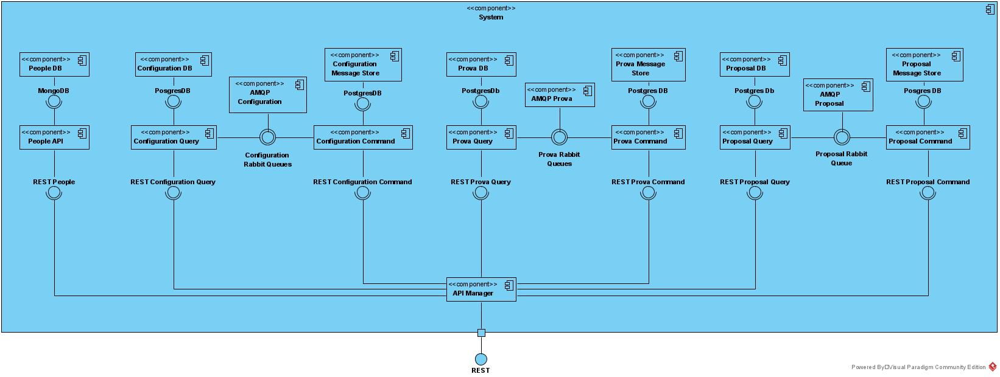
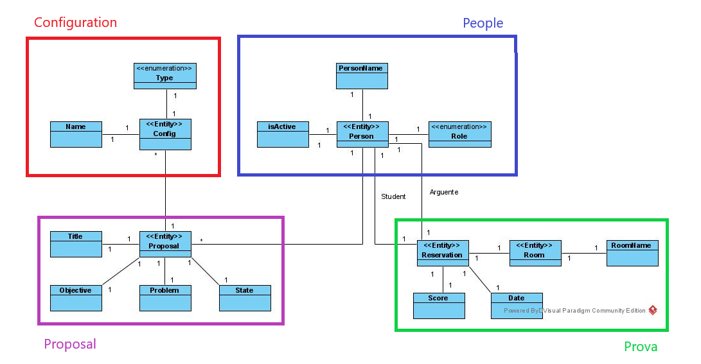

## Styles, patterns and good practices used

* Given the reduced complexity of the people management service, a
standalone microservice that allows you to query, create, change or remove people through
of HTTP requests.
* Database per service, as its name implies, makes use of a single database per service,
one for each microservice. For services developed in Spring-boot, a
PostgresSQL database was used and for the services implemented in NestJs MongoDB was used.
* Regarding the services of configurations, proposals and tests, a
set of patterns, as they were required, exposed in the next points.
* CQRS standard, as two microservices were created for each of the
management, where one (Command), is responsible for receiving all requests related to the
creation, deletion or alteration of data, and a second (Query), responsible for receiving
all read requests and return the intended data.
* Event Sourcing, used in all Command microservices, in which they are registered
all events that pass through the service and, in this way, obtain not only the current state of the
system, as well as all the steps leading up to that point.
* Messaging by MB, as already mentioned and evidenced in the diagram presented,
all microservices (with the exception of the people service) make use of
messages, in order to establish communication between the different microservices using RabbitMQ.
* Saga/Eventual consistency, in order to ensure data consistency between the two
microservices of each management software, another queue was created responsible for
just receive any errors that occur in the query service. This way the service
command, when reading from this queue, logs the events related to the errors that occurred in order to
keep the state of the data up to date and consistent.

## Domain Model

